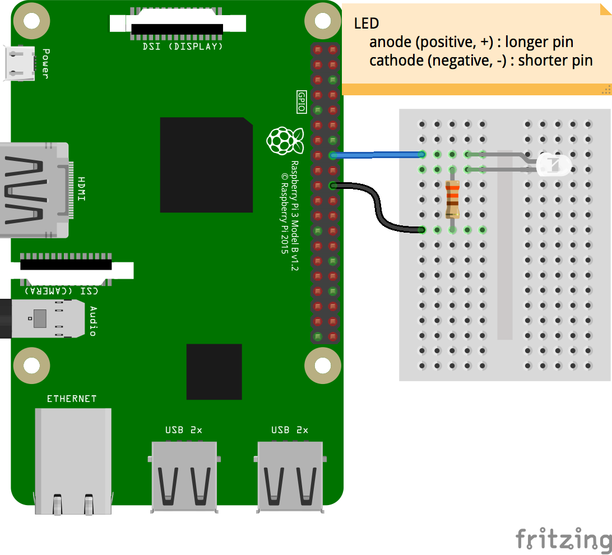
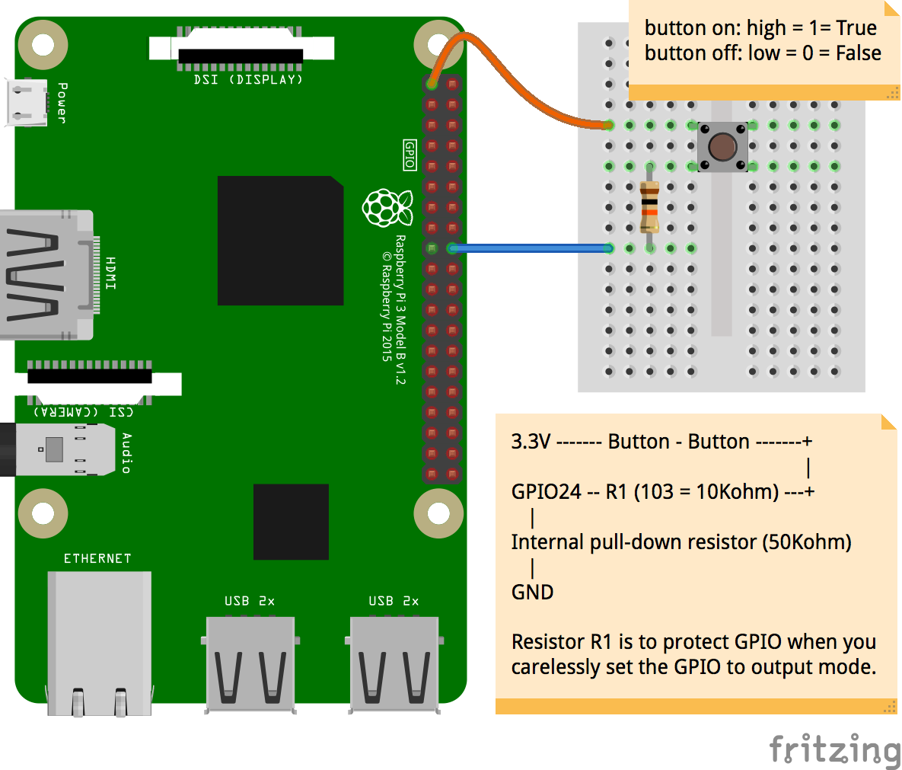

# gpiozero-recipes

Sample recipes of [gpiozero](https://gpiozero.readthedocs.io/en/stable/index.html), a simple interface to GPIO devices with Raspberry Pi.

## List of recipes

- [01-LED-blinky-01.py](./01-LED-blinky-01.py)
[--> wiring ](images/01-LED-blinky-01_bb.png)
[--> circuit](images/01-LED-blinky-01_schem.png)

- [02-hello-button-01.py](./02-hello-button-01.py)
[--> wiring ](images/02-hello-button-01_bb.png)
[--> circuit](images/02-hello-button-01_schem.png)

- [03-LED-button-01.py](./03-LED-button-01.py)
[--> wiring ](images/03-LED-button-01_bb.png)
[--> circuit](images/03-LED-button-01_schem.png)

- [04-PWM-LED-01.py](./04-PWM-LED-01.py)
[--> wiring ](images/04-PWM-LED-01_bb.png)
[--> circuit](images/04-PWM-LED-01_schem.png)

- [05-servo-01.py](./05-servo-01.py)
[--> wiring ](images/05-servo-01_bb.png)
[--> circuit](images/05-servo-01_schem.png)

- [06-light-sensor-01.py](./06-light-sensor-01.py)
[--> wiring ](images/06-light-sensor-01_bb.png)
[--> circuit](images/06-light-sensor-01_schem.png)


## How to eat, or run the code

1. Clone the code down to you computer.
2. Go into the working directory.
3. Make the circuits with circuit diagrams made with [Fritzing](http://fritzing.org/home/).
4. Run the code by Python.
5. Enjoy coding, hacking, and tinkering!

```
$ cd Documents
$ cd Python\ Projects
$ git clone paste-the-URL-from-the-green-button-of-Clone-or-download
$ cd gpio-recipes
$ python3 01-LED-blinky
```
